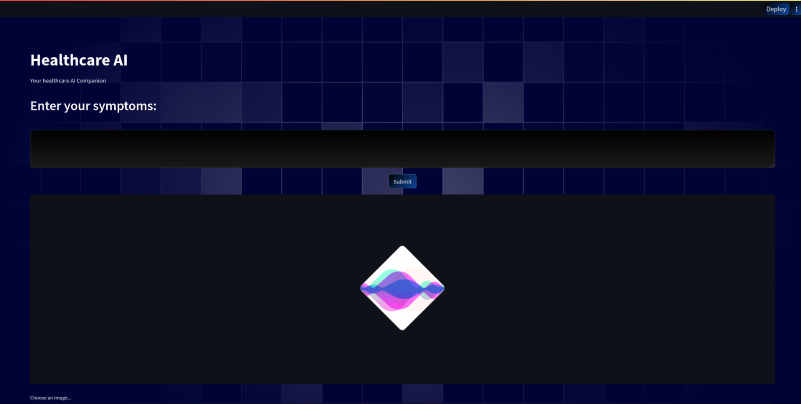

# 🏥 Healthcare AI Companion



**The Healthcare AI Companion is an intelligent healthcare tool that combines advanced deep learning models for image classification and text-based symptom analysis. This tool helps in the early detection of diseases based on X-ray images and symptom descriptions. It utilizes state-of-the-art deep learning models and Intel's oneAPI libraries for optimization.**

## ✨ Features
- **🖼️ Image Classification:** Upload chest X-ray images to detect pneumonia using a pre-trained tensorflow cnn  model.
- **💬 Symptom Analysis:** Enter symptoms as text, and the tool provides predictions for the top three likely diseases.
- **🧠 Deep Learning:** Utilizes Convolutional Neural Networks (CNNs) and Long Short-Term Memory (LSTM) models for accurate predictions.
- **🚀 Intel Optimization:** Optimized using Intel oneAPI libraries for efficient performance on Intel hardware.

## 🌐 Frontend (Streamlit)
The frontend of this tool is built using Streamlit, a user-friendly Python library for creating web applications. Users can interact with the AI models through a web-based interface.

## 🚀 Usage
1. **Enter Symptoms:** On the web interface, enter symptoms in the text area and click the "Submit" button. The tool will predict the top three likely diseases based on the symptoms.

2. **Upload X-ray Images:** You can also upload chest X-ray images (in JPG, PNG, or JPEG format) to check for pneumonia. The tool will classify the image and provide results.

## ⚙️ Installation
1. **Clone this GitHub repository:**
   ```bash
   git clone https://github.com/yourusername/healthcare-ai-companion.git
   cd healthcare-ai-companion

2. **Install the required Python packages:**
   ```bash
   pip install tensorflow
   pip install numpy
   pip install pandas
   pip install opencv-python

3. **Start the Streamlit frontend: (Recommended after installing the API toolkits)**
   ```bash
   streamlit run app.py

## 🧰 AI Toolkit (FastAPI and Deep Learning Models)

The backend of this tool is powered by FastAPI, a modern web framework for building APIs. It uses deep learning models for image classification and symptom analysis.

### 🛠️ Technologies Used

+ **Intel oneDNN (Deep Neural Network Library):** Optimizes CNN and LSTM layers for efficient disease detection.
+ **Intel oneDAL (Data Analytics Library):** Provides data preprocessing and feature engineering capabilities.
+ **IPEX (Intel Extension for PyTorch):** Optimizes model training and accelerates deep learning workloads on Intel CPUs.


### ⚙️ Installation

1. **Install FastAPI and Uvicorn:**

   ```bash
   pip install fastapi uvicorn

2. **Start the FastAPI backend:**

   ```bash
   uvicorn api_testing:app --reload

Make sure to have Python 3.x, PyTorch, and the required Intel oneAPI libraries installed.

## 🧬 Deep Learning Healthcare Detector

This project implements a healthcare detector that combines a Convolutional Neural Network (CNN)-based X-ray Pneumonia Detector and a Recurrent Neural Network (RNN)-based Natural Language Processing (NLP) Disease Detector. The detectors are optimized using Intel oneAPI libraries, including Intel oneDNN (Deep Neural Network Library), Intel oneDAL (Data Analytics Library), and IPEX (Intel Extension for PyTorch). The primary objectives of this project are to detect pneumonia in chest X-ray images and identify diseases based on symptoms using cutting-edge deep learning techniques fine-tuned and accelerated for Intel hardware.

**Technologies Used :-**

### Intel oneDNN (Deep Neural Network Library) 🧠

+ Intel oneDNN, also known as MKL-DNN, is a powerful library designed to accelerate deep learning workloads. It provides optimized primitives for convolutional neural networks (CNNs), recurrent neural networks (RNNs), and other neural network operations. In this project, oneDNN is leveraged for:-

+ **Optimizing CNN layers:** oneDNN accelerates convolutional layers, improving the performance of image-based disease detection in X-ray images.

+ **Enhancing RNN operations:** oneDNN optimizes recurrent layers, enabling efficient processing of sequential medical symptom data for disease detection.

### Intel oneDAL (Data Analytics Library) 📊

+ Intel oneDAL is a versatile library for data preprocessing, transformation, and analysis. While it is not the primary focus of this project, oneDAL can be utilized for various data-related tasks, including:

+ **Data preprocessing:** oneDAL can be employed to preprocess and clean medical datasets, ensuring data quality and consistency.

+ **Feature engineering:** The library offers tools for feature engineering, which can be vital for improving the accuracy of disease detection models.

### IPEX (Intel Extension for PyTorch) 🔥

+ IPEX is an extension for PyTorch that optimizes deep learning workloads on Intel hardware. It provides features for model optimization, mixed-precision training, and hardware-specific acceleration. In this project, IPEX plays a crucial role in:

+ **Accelerating model training:** IPEX optimizes the training process, ensuring that the models converge faster and perform efficiently on Intel CPUs.

+ **Mixed-precision training:** With IPEX, mixed-precision training can be enabled, leveraging lower-precision data types for training without sacrificing model accuracy.

+ **Hardware acceleration:** IPEX takes advantage of Intel-specific hardware acceleration capabilities, making the most of Intel CPUs for both CNN and RNN-based detectors.

### Project Objectives ⚔️

+ **X-ray Pneumonia Detector:** The CNN-based detector aims to identify pneumonia in chest X-ray images, contributing to early diagnosis and treatment.

+ **NLP Disease Detector:** The RNN-based NLP detector leverages natural language processing techniques to identify diseases based on symptom descriptions provided by patients.

+ **Intel Optimization:** The project prioritizes the use of Intel oneAPI libraries to optimize the performance and efficiency of the detectors on Intel hardware.

### Usage

Follow the provided documentation and instructions to set up and run the X-ray Pneumonia Detector and NLP Disease Detector. Ensure you have the required dependencies, including Python 3.x, PyTorch, Intel oneAPI libraries, and access to suitable medical datasets for training and testing.


### 🙏Acknowledgments

 + **Streamlit**
 + **FastAPI**
 + **TensorFlow**
 + **Intel oneAPI**
 
